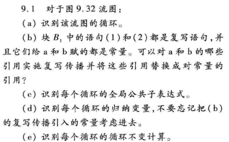
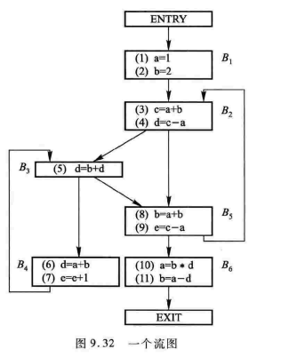
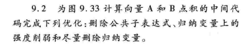
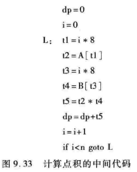

# HW7

## 9.1

## 9.2

## 9.3

> 对图9.32的流图，计算：
>
> - 为到达-定值分析，计算每个块的gen、kill、IN和OUT集合
> - 为可用表达式分析，计算每个块的e_gen、e_kill、IN和OUT集合
> - 为活跃变量分析，每个块的def、use、IN和OUT集合

## 9.15（a）（f）

> 对图9.32的流图：
>
> (a)计算支配关系
>
> (f)找出该流图的自然循环