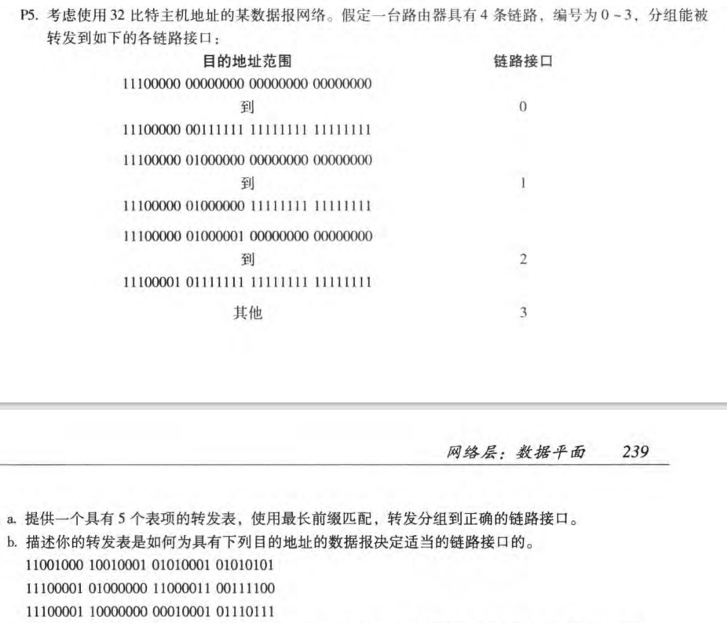
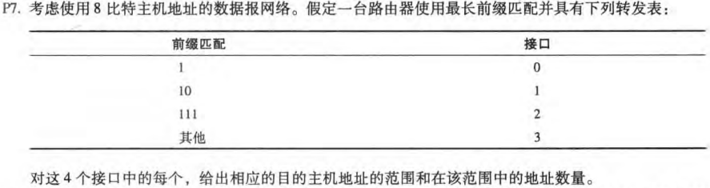
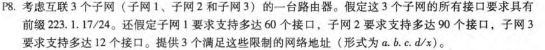
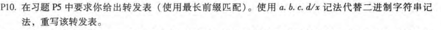
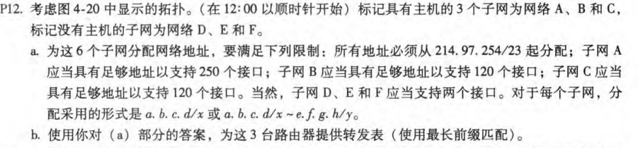
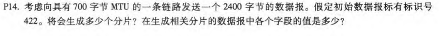

# HW4

## P5

- | 前缀匹配          | 链路接口 |
  | ----------------- | -------- |
  | 11100000 00       | 0        |
  | 11100000 01000000 | 1        |
  | 1110000           | 2        |
  | 11100001 1        | 3        |
  | 其他              | 3        |

  

- 第一个最长前缀匹配是其他，链路接口为3

  第二个最长前缀匹配是1110000，链路接口为2

  第三个最长前缀匹配是11100001 1，链路接口为3

## P7

1100 0000到1101 1111      接口0     地址数量：$2^5=32$

1000 0000到1011 1111      接口1     地址数量：$2^6=64$

1110 0000到1111 1111      接口2     地址数量：$2^5=32$

0000 0000到0111 1111      接口3     地址数量:$2^8-64-32-32=128$

## P8

子网1:60个接口，$2^6=64$,地址长度为26

子网2:90个接口，$2^7=128$,地址长度为25

子网1:12个接口，$2^4=16$,地址长度为28

所以，网络地址可以如下分配：

子网1    :     223.1.17.0/26

子网2    :     223.1.17.128/25

子网3    :     223.1.17.192/28

## P10

## P12

## P14

