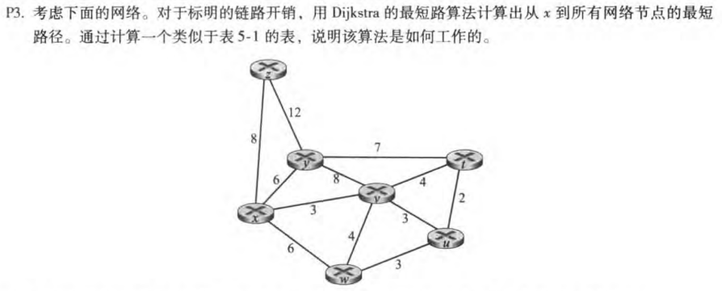
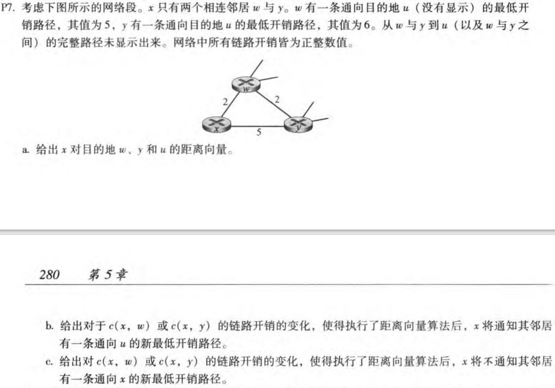
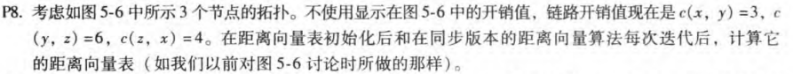
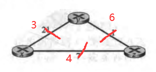
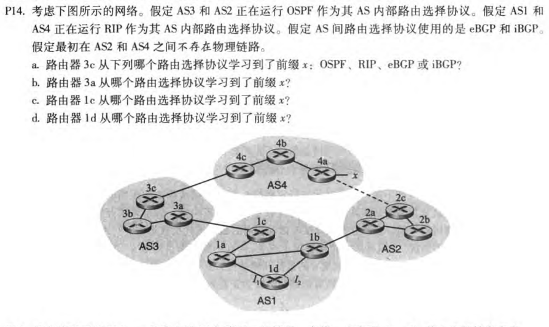
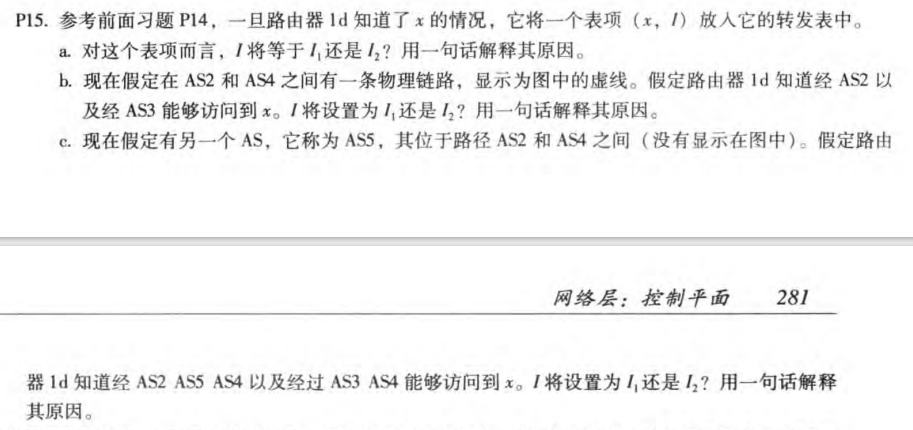

# HW5

## P3

| Step | N       | D(t),p(t) | D(u),p(u) | D(v),p(v) | D(w),p(w) | D(y),p(y) | D(z),p(z) |
| ---- | ------- | --------- | --------- | --------- | --------- | --------- | --------- |
| 0    | x       | $\infty$  | $\infty$  | 3,x       | 6,x       | 6,x       | 8,x       |
| 1    | xv      | 7,v       | 6,v       | 3,x       | 6,x       | 6,x       | 8,x       |
| 2    | xvu     | 7,v       | 6,v       | 3,x       | 6,x       | 6,x       | 8,x       |
| 3    | xvuw    | 7,v       | 6,v       | 3,x       | 6,x       | 6,x       | 8,x       |
| 4    | xvuwy   | 7,v       | 6,v       | 3,x       | 6,x       | 6,x       | 8,x       |
| 5    | xvuwyt  | 7,v       | 6,v       | 3,x       | 6,x       | 6,x       | 8,x       |
| 6    | xvuwytz | 7,v       | 6,v       | 3,x       | 6,x       | 6,x       | 8,x       |

## P7

- $D_x(w)=2,D_x(y)=4,D_x(u)=7$

- 如果c（x,y）变化，c（x,y）=t<1时，最小开销变为t+6

  如果c（x,w）变化，c（x,w）=t，

  ​    t<6时，最小开销变为t+5

  ​    t>=6时，最小开销变为11

- 如果c（x,y）变化，c（x,y）=t>=1时，最低开销还是xwu的7，所以不会通知

## P8

## P14

## P15

