# IP实验

## Q1

> Select the first ICMP Echo Request message sent by your computer, and expand the Internet Protocol part of the packet in the packet details window.What is the IP address of your computer?

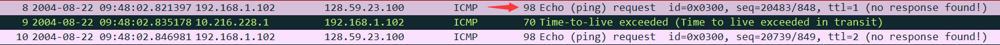

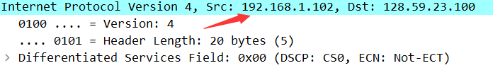

IP为192.168.1.102

## Q2

> Within the IP packet header, what is the value in the upper layer protocol field?

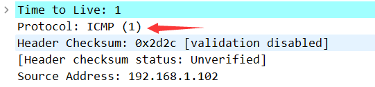

ICMP（1）

## Q3

> How many bytes are in the IP header? How many bytes are in the payload of the IP datagram? Explain how you determined the number of payload bytes.

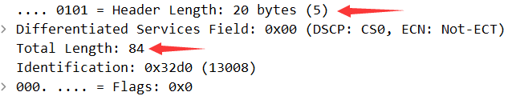

报头20字节，总共84字节，所以payload bytes是84-20=64字节

## Q4

> Has this IP datagram been fragmented? Explain how you determined whether or not the datagram has been fragmented

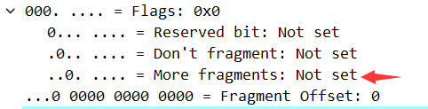

flags字段中的More fragments没有置位，为0，所以没有分片

## Q5

> Which fields in the IP datagram always change from one datagram to the next within this series of ICMP messages sent by your computer?

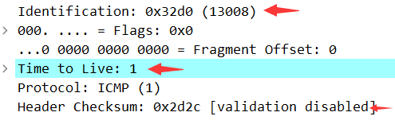

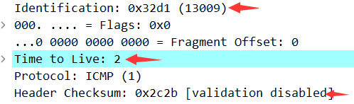

identification（标识符）、time to live（存在时间）、header checksum（首部检验和）在改变

## Q6

> Which fields stay constant? Which of the fields must stay constant? Which fields must change? Why?

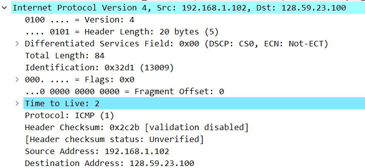

- 图中所示，除了Q5中所改变，其余Version,Header Length,Differentiated Services Field,Total Length,Flags Fragment Offset,Protocol,Source Address,Destination Address保持不变

- 其中必须保持不变的有：Version, Header Length, Differentiated Services Field, Protocol,Source,Address, Destination Address

- 必须改变的是Q5中提到的Identification、Time to Live、Header Checksum，因为Identification用来唯一标识数据报，Time to Live是因为traceroute程序会发送该字段递增的报文，在跳数计数器的作用下来避免报文永远存在，Header Checksum是因为该字段是首部检验和，只要有首部字段发生改变，该字段就会变化

## Q7

> Describe the pattern you see in the values in the Identification field of the IP datagram

还是Q5中的图可以看出是递增1的

## Q8

> What is the value in the Identification field and the TTL field?

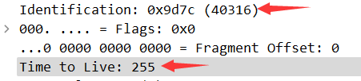

Identification为0x9d7c（40316）

TTL为255

## Q9

> Do these values remain unchanged for all of the ICMP TTL-exceeded replies sent to your computer by the nearest (first hop) router? Why

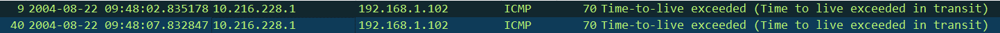

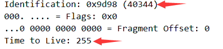

ID改变了，TTL没有变，因为ID是对数据报的唯一标识，而TTL不变是因为它们都是第一跳路由器发出的，具有相同的寿命

## Q10

> Find the first ICMP Echo Request message that was sent by your computer after you changed the Packet Size in pingplotter to be 2000. Has that message been fragmented across more than one IP datagram?

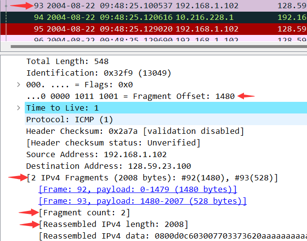

分为了2片