# ARP实验

## Q1

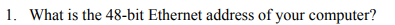

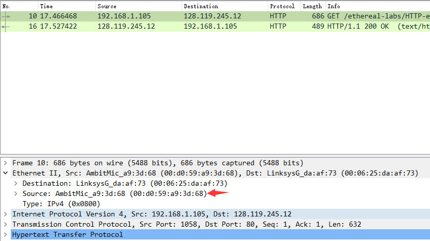

源地址：AmbitMic_a9:3d:68 (00:d0:59:a9:3d:68)

## Q2

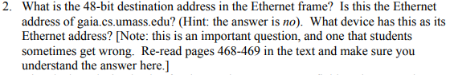

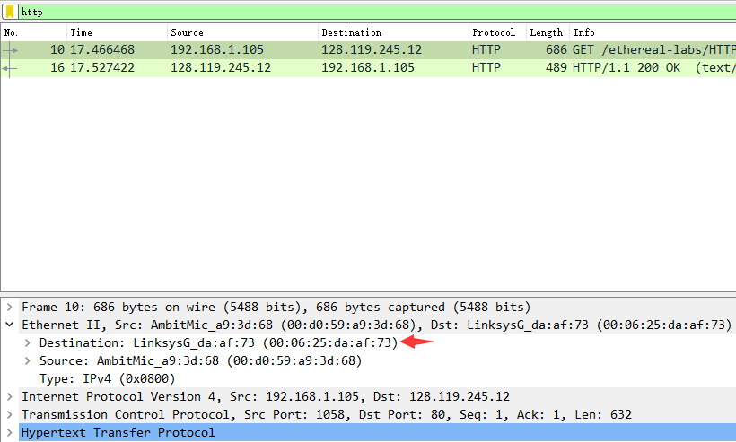

目的地址: LinksysG_da:af:73 (00:06:25:da:af:73)

不是gaia.cs.umass.edu的以太网地址

是出子网的路由器接口的地址

## Q3

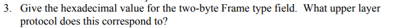

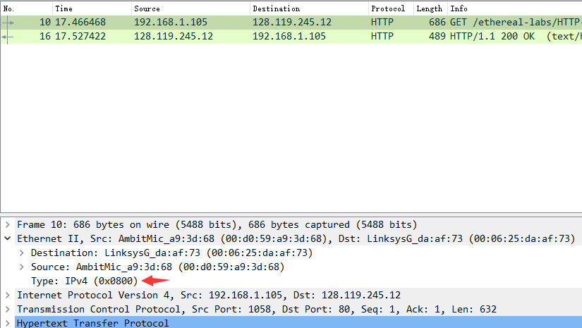

0x0800

表示上层协议是 IPv4

## Q4

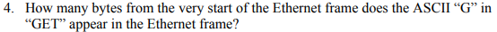

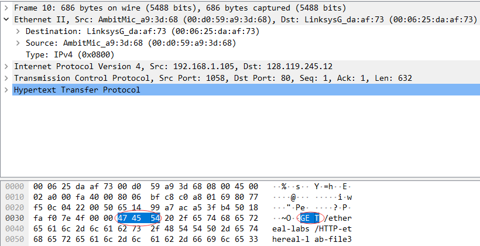

G对应47，之前一共3*16+6=54字节，算上G出现是55字节

## Q5

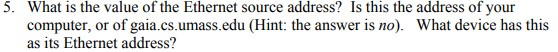

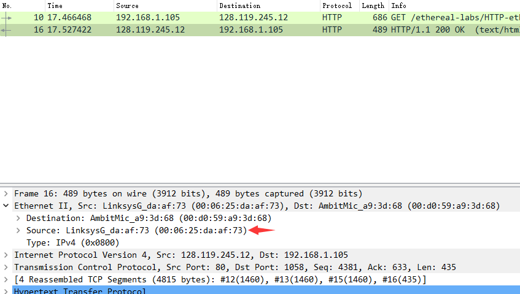

源地址：LinksysG_da:af:73 (00:06:25:da:af:73)

不是

是出子网的路由器的接口地址

## Q6

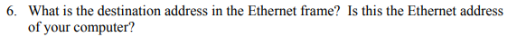

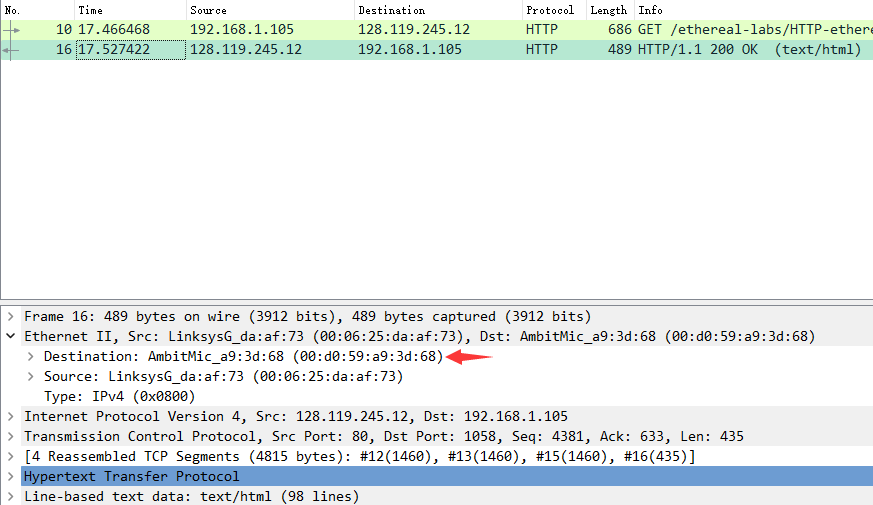

目的地址：AmbitMic_a9:3d:68 (00:d0:59:a9:3d:68)

是我的计算机的以太网地址

## Q7

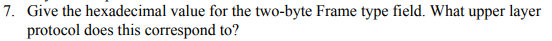

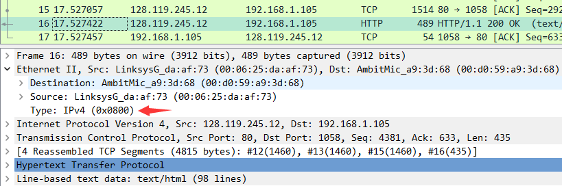

0x0800

表示上层协议是 IPv4

## Q8

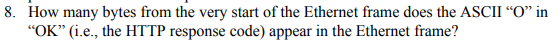

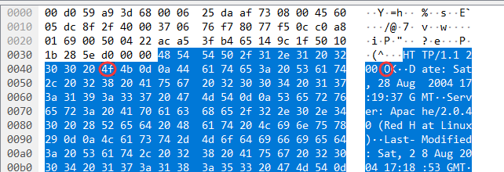

O对应4f，之前有16*4+3=67字节，算上O是68字节

## Q9

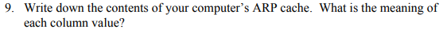

方框从上向下按顺序是：网卡、路由IP、MAC地址、广播地址、组播地址

## Q10

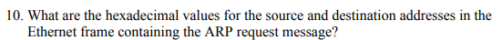

## Q11

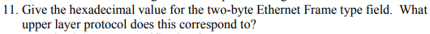

## Q12

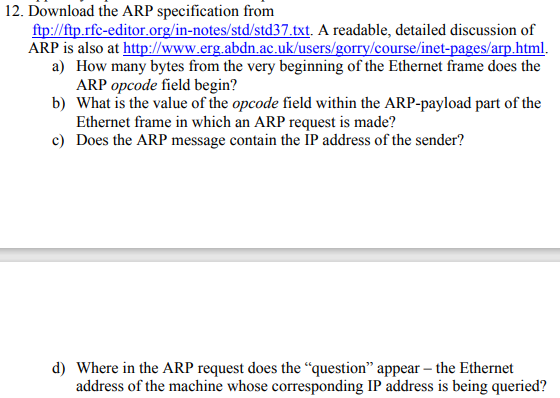

## Q13

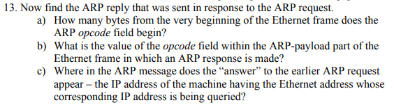

## Q14

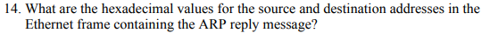

## Q15

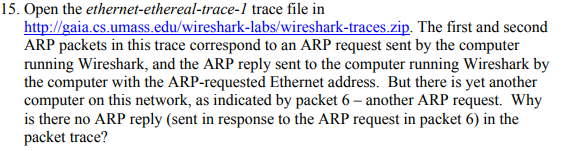