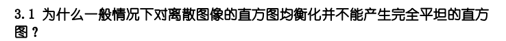
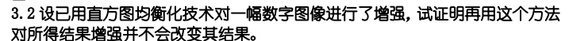
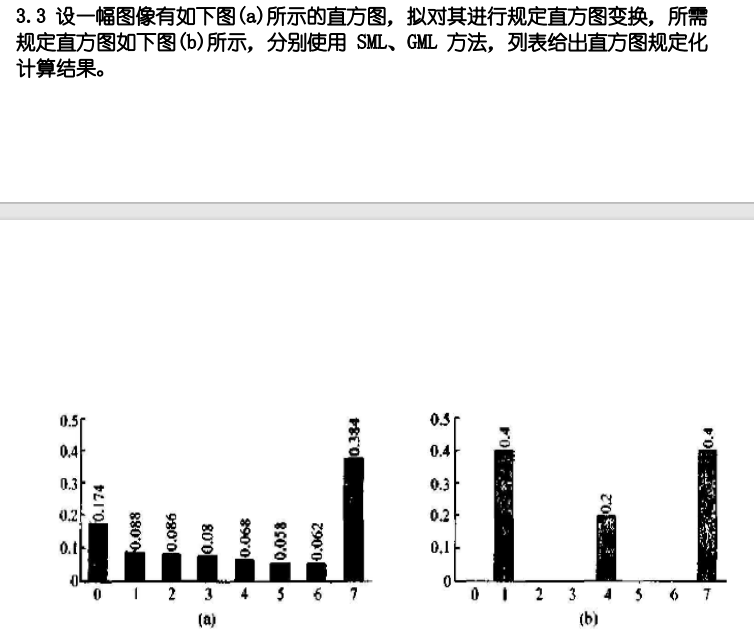
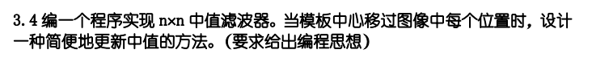

# HW2

## 3.1

直方图均衡化前后的灰度级的映射关系是一对一或者多对一，调整后灰度级的概率基本不能取得相同的值，所以得不到完全理想的均衡，也就是不能产生完全平坦的直方图

## 3.2

直方图均衡化通过变换函数将原始图像的灰度级映射到新的灰度级，这个过程有的一一对应，有的进行了合并，最后得到均衡化后的直方图，如果再次对这个直方图进行均衡化，该合并的在上一步已经合并过，所以第二次均衡化都是一一对应的关系，所以最后结果不变

## 3.3

- SML

- GML

## 3.4

