# 算法 

**带（*）的是附加题会出现的**

## 渐近标记和递归方程

2.pdf

#### 函数迭代：


（就是lglg...lgn这样

#### 主定理：

（卷子会给


- 求$n^{log_ba}$与f（n）比较（阶），谁大取谁(f(n)大时还要判断一下后续条件）

- $f(n)=\Theta(n^{log_ba}lg^kn),$，取$\Theta(n^{log_ba}\cdot lg^{k+1}n)$

  

  例子如下：

  

## 基于比较的排序算法

3.pdf

**假定在待排序的记录序列中，存在多个具有相同的关键字的记录，若经过排序，这些记录的相对次序保持不变，即在原序列中，A1=A2，且A1在A2之前，而在排序后的序列中，A1仍在A2之前，则称这种排序算法是稳定的**

#### 八大排序比较表：

| 排序法 | 最好情况 |      平均时间      |  最差情形   | 稳定度 | 额外空间 |             备注              |
| :----: | -------- | :----------------: | :---------: | :----: | :------: | :---------------------------: |
|  冒泡  | $O(n)$   |      $O(n^2)$      |  $O(n^2)$   |  稳定  |   O(1)   |           n小时较好           |
|  选择  | $O(n^2)$ |      $O(n^2)$      |  $O(n^2)$   | 不稳定 |   O(1)   |           n小时较好           |
|  插入  | $O(n)$   |      $O(n^2)$      |  $O(n^2)$   |  稳定  |   O(1)   |      大部分已排序时较好       |
|  基数  |          |      O(logRB)      |  O(logRB)   |  稳定  |   O(n)   | B是真数(0-9)，R是基数(个十百) |
|  希尔  |          | 与分组有关O(nlogn) | O(ns) 1<s<2 | 不稳定 |   O(1)   |          s是所选分组          |
|  快速  | O(nlogn) |      O(nlogn)      |  $O(n^2)$   | 不稳定 | O(logn)  |           n大时较好           |
|  归并  |          |      O(nlogn)      |  O(nlogn)   |  稳定  |   O(1)   |           n大时较好           |
|   堆   | O(nlogn) |      O(nlogn)      |  O(nlogn)   | 不稳定 |   O(1)   |           n大时较好           |


####  插入排序：

在一个已经有序的小序列（刚开始第一个元素）的基础上，一次插入一个元素。从这个小序列的末尾开始的。想要插入的元素和小序列的最大者开始比起，如果比它大则直接插在其后面，否则一直往前找它该插入的位置


#### 选择排序：

首先在未排序序列中找到最小（大）元素，存放到排序序列的起始位置。再从剩余未排序元素中继续寻找最小（大）元素，然后放到已排序序列的末尾


（可以通过元素后移而不是交换实现稳定排序

#### 冒泡排序：

每次比较相邻两个元素，不符合顺序就交换


#### 希尔排序：

对增量序列t1-tk，总共k次排序

每次排序按照ti对序列进行分组，在组内进行插入排序

（一般分组间隔从n/2开始，每次分组间隔减半，最后分组间隔为1进行插入排序效率就比较高了


#### 堆排序：

堆是完全二叉树

最大堆：父节点大于子节点

局部维护：最大值放在根


创建最大堆：（这里假设从1开始索引，如果是从0开始应该是[n/2]-1  to 0）一步步构建最大堆，注意交换后可能产生新的不符合堆性质的需要再次调整


完成排序：每次从堆顶取出最大值（最后一个孩子结点与其交换），然后维护堆性质


#### 快速排序：

选取一个基准数，将大于和小于分在这个基准树两边（i,j遍历，i是小于，j是大于，j对应大于基准j++，小于基准则i++，swap，j++），再在两边分别快排


## 线性时间内排序

4_ch8.pdf


## 中位数和顺序统计

4_ch9.pdf


## 二叉搜索树、红黑树

5_1.pdf


## 二项式堆、斐波那契堆、不相交集的数据结构

5_2.pdf


## 动态规划

6_1_ch15

- 优化解包含子问题的优化解（优化子结构）
- 子问题不独立

#### 棒切割

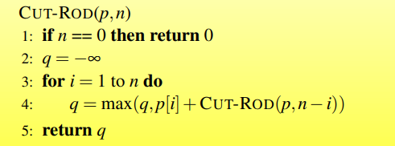

#### 矩阵链乘法

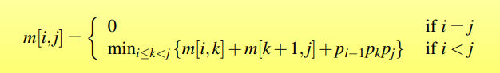

ans=m[1] [n]

$O(n^3)$

#### 最长公共子序列

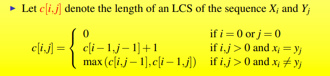

O（mn）

ans=c[n] [m]

## 贪心算法

6_1_ch16

局部最优解

#### 分配问题

优先使用最小的补给分配给最少需求

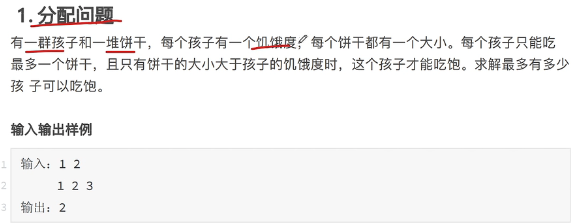

#### 区间问题

优先保留结尾最小的区间，为了给剩下预留更多空间

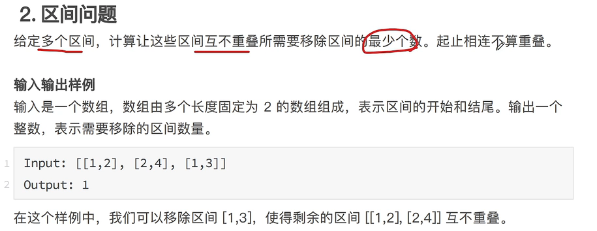

#### Huffman 编码

每次选取频率最低的两个字符作为子节点，向上生成父节点，将两者之和作为父节点的频率接入频率集合中

## *背包问题

01backpack.pdf


## 摊还分析

6_3_ch17.pdf

**与渐进分析区别**

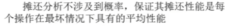

#### 合计法

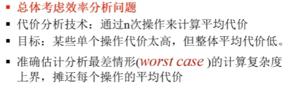

#####  动态表的插入：

- 未满，直接插入，代价1
- 满了，开新表，移入数据，代价1+移入次数

如果是渐进分析，总是考虑满的情况

摊还分析：

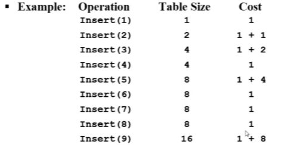

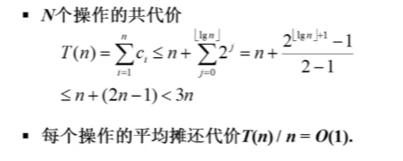

##### 栈操作

 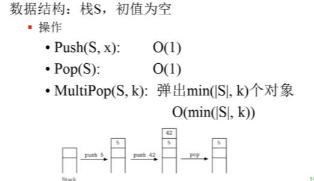

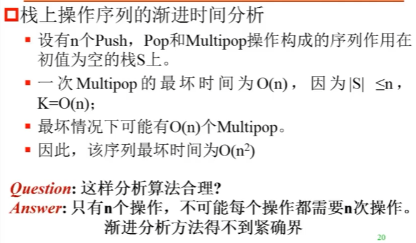

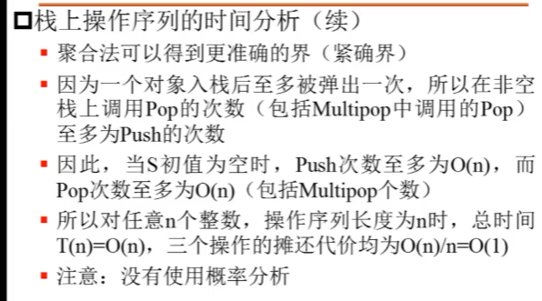

##### 二进制计数器

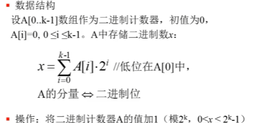

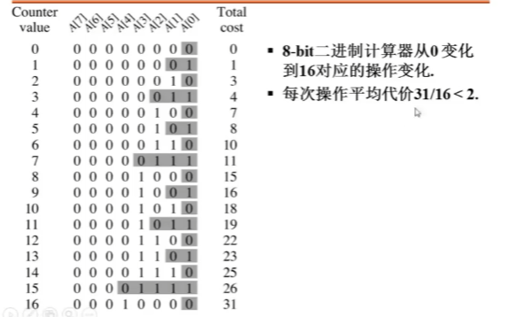

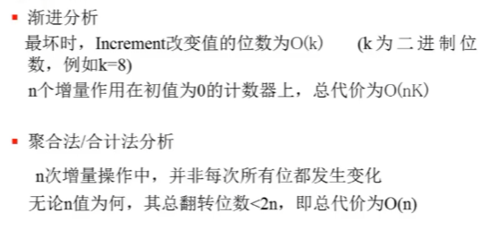

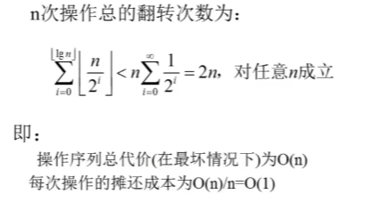


#### 核算法

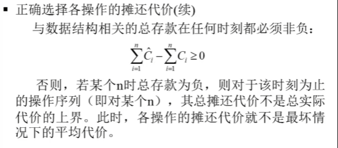

##### 动态表的插入

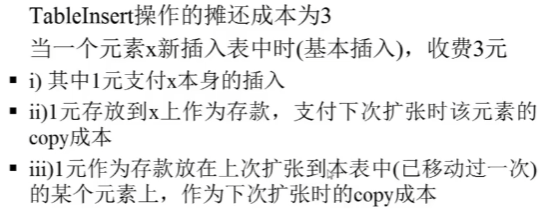


##### 栈操作

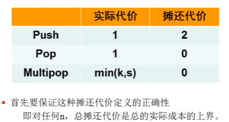

push多出来的一个代价就是储存在刚刚入栈的数据上，保证出栈的时候摊还代价始终大于等于实际代价

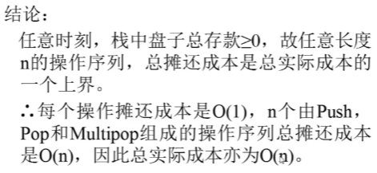

##### 二进制计数器

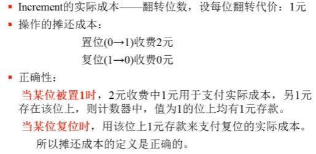

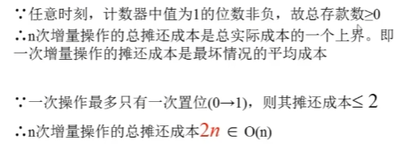


#### 势能法

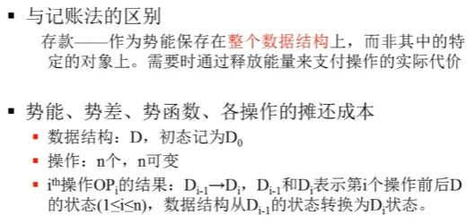


##### 栈操作

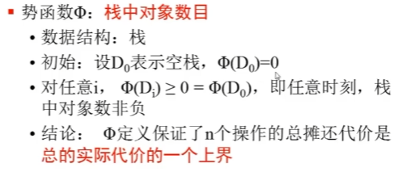

 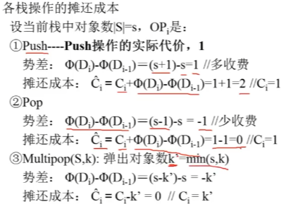

## 分治策略

6_4.pdf

#### 大整数乘法

切分：

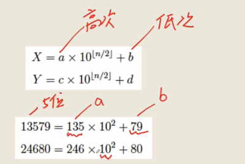

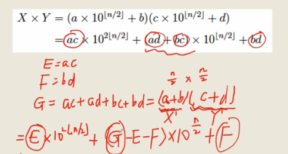

减少了子问题，从需要计算ac、ad、bc、bd转为计算E、F、G三个子问题

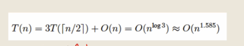


#### Strassen算法

普通矩阵乘法：

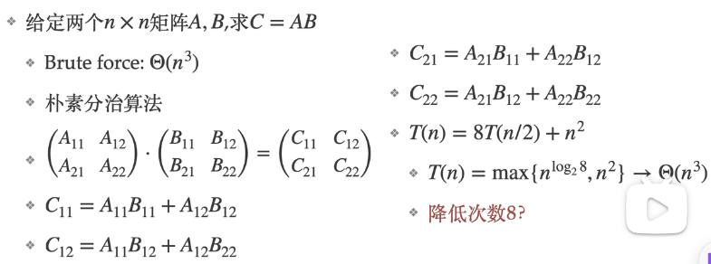

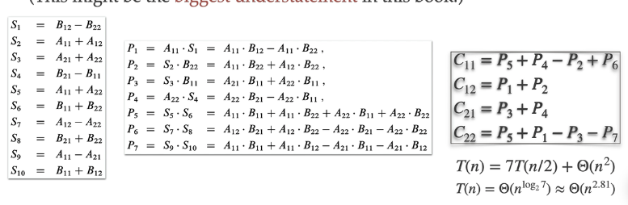

#### 残缺棋盘

没有特殊格子的三个[n/2]用一个L形覆盖，变为四个相同的子问题，再同样对四个子问题进行同样处理

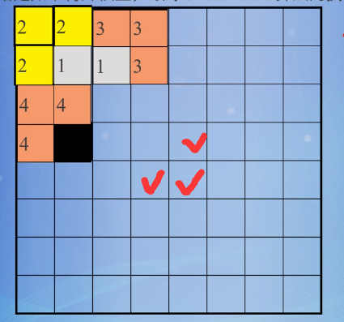

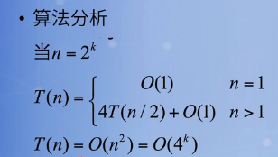


## *在线算法

onlineAlgorithm.pdf


## 基本图算法

7_ch22.pdf

#### 邻接表

链表指向相邻的所有结点，所有链表组成一个数组

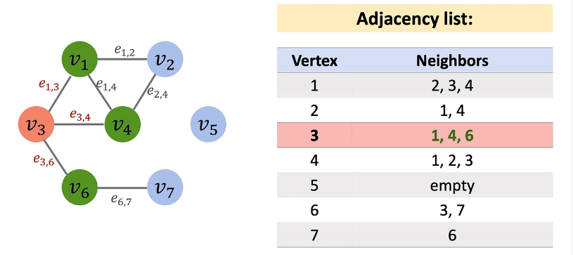

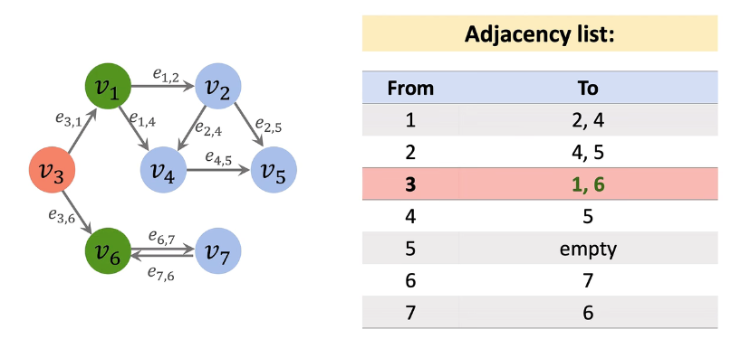

#### 邻接矩阵

表格中为横到纵的权重

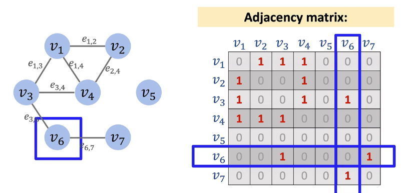

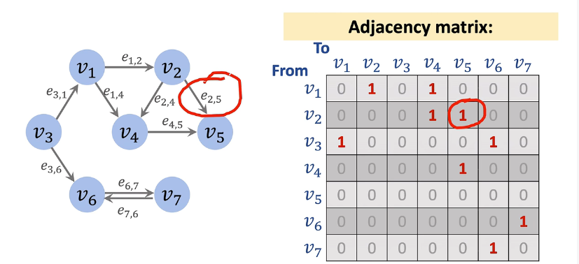

#### BFS

广度优先，用先进先出的队列

- 访问初始顶点并标记
- 入队
- 进入循环，出队，所有（未访问的）邻接点入队
- 先进入的结点先出队，并把其未访问的邻接点入队，放在队尾（这样就实现了先遍历在队头的上一层的结点

#### DFS

对初始顶点的邻接点进行DFS，递归调用DFS，先进后出用栈，内存消耗少

##### 边分类

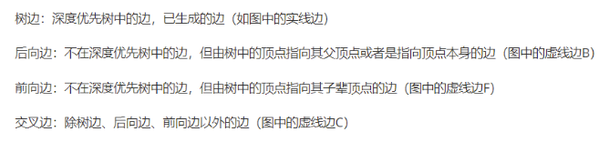

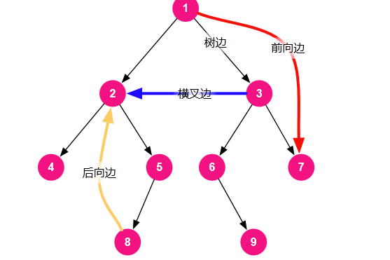

#### 拓扑排序

只对有向无环图

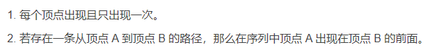

从入度为0的结点开始，删去与其相连的边，继续找入度为0的结点

#### 强连通分量

有向图中，两个顶点互相连通，则两个顶点强连通，图G所有顶点都强连通，则为强连通图，非强连通图的极大强连通子图为强连通分量

##### Tarjan算法

DFS遍历，形成两个时间戳，i(DFS(u))表示在DFS中访问的顺序，j（low(u) ）表示在回溯过程中可以回溯到的最早的时间点（在DFS时相同），然后进行回溯，更新j，将同一个j的出栈，一起出栈的就是一个强连通分量

时间复杂度：邻接表存储：$O(V+E)$

邻接矩阵存储：$O(V^2)$

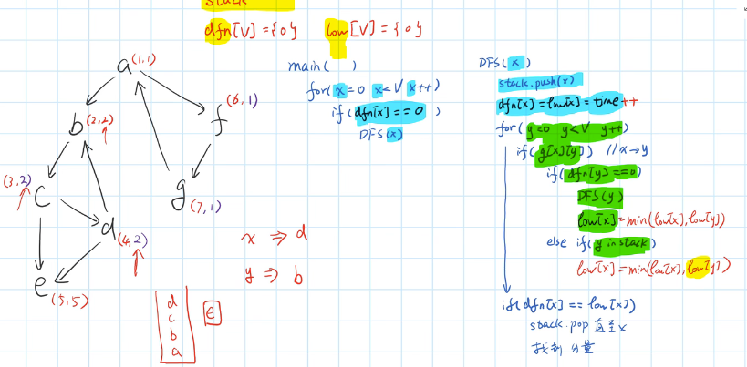

如上图中d，本应该是(4,4)，但是可以找到d->b的回边，所以d的最早时间回溯为2，改为(4,2)，再往后回溯c，本是(3,3)，d改为(4,2)后，c也可以回溯到b，所以改为(3,2)...

## 最小生成树

7_ch23.pdf

**Def：**n个结点，以及n-1条边，生成的树，其中最小权重之和的即为最小生成树

**安全边：**


**轻边：**

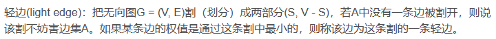

若割不妨碍A，则把轻边加入A中是安全的

Prim算法和Kruskal算法都是不断加入安全边的过程

#### Prim算法

（贪心算法

- 选一个作为根结点，加入集合U

- 从剩下的结点中选出与U相连的权重最小的边，这个边连接的另一个顶点加入U

  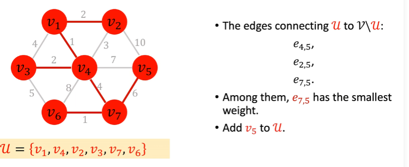


#### Kruskal算法

（贪心算法

思想是将图的结点视为单独的树，整个是一个森林，然后每次找最短的边（边连接的两个结点不在同一棵树中），合并两棵树，直到只有一棵树

可以基于并查集实现

## 单源最短路径

7_ch24.pdf

起点s到其他所有顶点的最短路径

#### Bellman-ford算法

**适用**：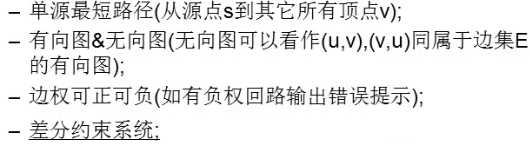

> 为什么不能处理负权回路：如果存在负权回路，一定会在下一次遍历边时继续松弛，因为绕一圈回路就会使得路径更短

**核心思想**：对所有的边进行n-1轮松弛操作，第一轮松弛可以得到距离已知最短路径一条边的顶点的最短路径，后续一样操作......

> 松弛操作： 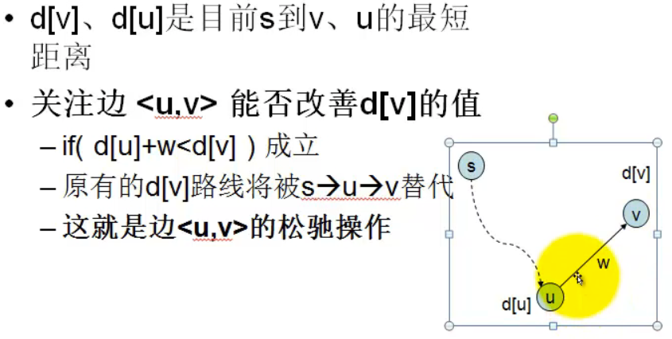

```c++
for (var i = 0; i < n - 1; i++) {
    for (var j = 0; j < m; j++) {//对m条边进行循环
      var edge = edges[j];
      // 松弛操作
      if (distance[edge.to] > distance[edge.from] + edge.weight ){ 
        distance[edge.to] = distance[edge.from] + edge.weight;
      }
    }
}
```

**最后再进行一次遍历边，如果还需要松弛就说明存在负权回路**

时间复杂度为$O(VE)$


#### Dijkstra算法


## 所有点对最短路径 

7_ch25.pdf


## 最小流

7_ch26.pdf


## 字符串匹配

8_ch32.pdf


## NP完备

9_1_ch34.pdf


## *近似算法

9_2_ch32.pdf