# 算法复习

**带（*）的是附加题会出现的**

## 渐近标记和递归方程

2.pdf

#### 函数迭代：

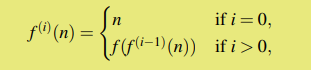

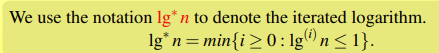

（就是lglg...lgn这样

#### 主定理：

（卷子会给

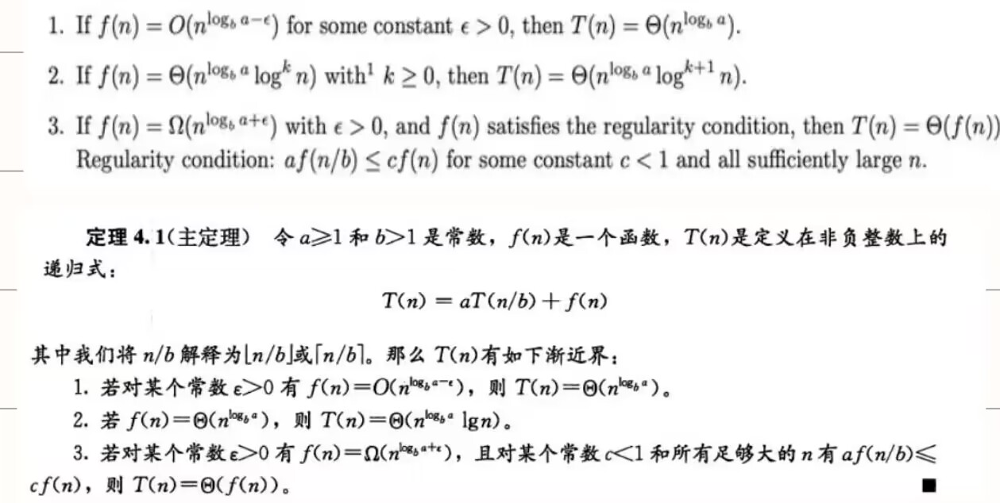

- 求$n^{log_ba}$与f（n）比较（阶），谁大取谁(f(n)大时还要判断一下后续条件）

- $f(n)=\Theta(n^{log_ba}lg^kn),$，取$\Theta(n^{log_ba}\cdot lg^{k+1}n)$

  

  例子如下：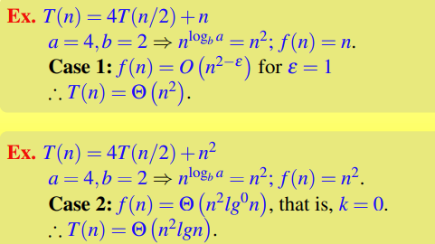

  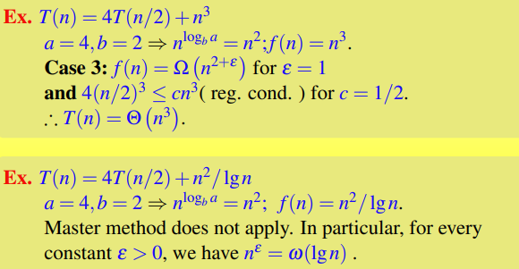

## 基于比较的排序算法

3.pdf

**假定在待排序的记录序列中，存在多个具有相同的关键字的记录，若经过排序，这些记录的相对次序保持不变，即在原序列中，A1=A2，且A1在A2之前，而在排序后的序列中，A1仍在A2之前，则称这种排序算法是稳定的**

#### 八大排序比较表：

| 排序法 | 最好情况 |      平均时间      |  最差情形   | 稳定度 | 额外空间 |             备注              |
| :----: | -------- | :----------------: | :---------: | :----: | :------: | :---------------------------: |
|  冒泡  | $O(n)$   |      $O(n^2)$      |  $O(n^2)$   |  稳定  |   O(1)   |           n小时较好           |
|  选择  | $O(n^2)$ |      $O(n^2)$      |  $O(n^2)$   | 不稳定 |   O(1)   |           n小时较好           |
|  插入  | $O(n)$   |      $O(n^2)$      |  $O(n^2)$   |  稳定  |   O(1)   |      大部分已排序时较好       |
|  基数  |          |      O(logRB)      |  O(logRB)   |  稳定  |   O(n)   | B是真数(0-9)，R是基数(个十百) |
|  希尔  |          | 与分组有关O(nlogn) | O(ns) 1<s<2 | 不稳定 |   O(1)   |          s是所选分组          |
|  快速  | O(nlogn) |      O(nlogn)      |  $O(n^2)$   | 不稳定 | O(logn)  |           n大时较好           |
|  归并  |          |      O(nlogn)      |  O(nlogn)   |  稳定  |   O(1)   |           n大时较好           |
|   堆   | O(nlogn) |      O(nlogn)      |  O(nlogn)   | 不稳定 |   O(1)   |           n大时较好           |

####  插入排序：

在一个已经有序的小序列（刚开始第一个元素）的基础上，一次插入一个元素。从这个小序列的末尾开始的。想要插入的元素和小序列的最大者开始比起，如果比它大则直接插在其后面，否则一直往前找它该插入的位置

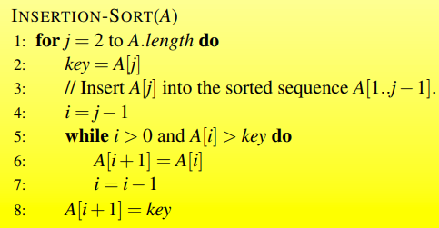

#### 选择排序：

首先在未排序序列中找到最小（大）元素，存放到排序序列的起始位置。再从剩余未排序元素中继续寻找最小（大）元素，然后放到已排序序列的末尾

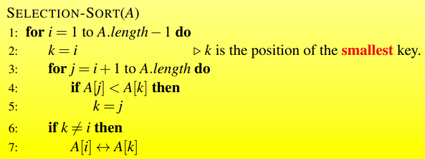

（可以通过元素后移而不是交换实现稳定排序

#### 冒泡排序：

每次比较相邻两个元素，不符合顺序就交换

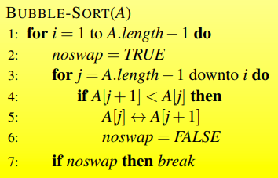

#### 希尔排序：

对增量序列t1-tk，总共k次排序

每次排序按照ti对序列进行分组，在组内进行插入排序

（一般分组间隔从n/2开始，每次分组间隔减半，最后分组间隔为1进行插入排序效率就比较高了

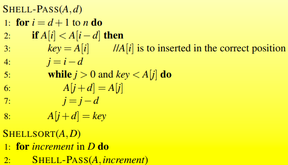

#### 堆排序：

堆是完全二叉树

最大堆：父节点大于子节点

局部维护：最大值放在根

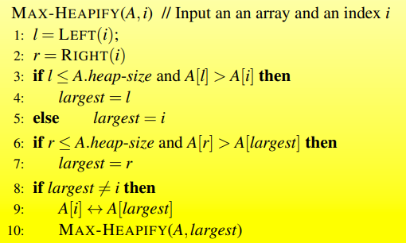

创建最大堆：（这里假设从1开始索引，如果是从0开始应该是[n/2]-1  to 0）一步步构建最大堆，注意交换后可能产生新的不符合堆性质的需要再次调整

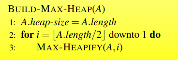

完成排序：每次从堆顶取出最大值（最后一个孩子结点与其交换），然后维护堆性质

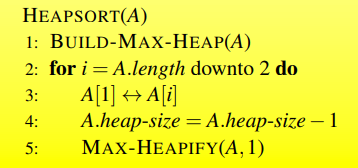

#### 快速排序：

选取一个基准数，将大于和小于分在这个基准树两边（i,j遍历，i是小于，j是大于，j对应大于基准j++，小于基准则i++，swap，j++），再在两边分别快排

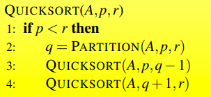

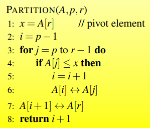

## 线性时间内排序

4_ch8.pdf

## 中位数和顺序统计

4_ch9.pdf

## 二叉搜索树、红黑树

5_1.pdf

## 二项式堆、斐波那契堆、不相交集的数据结构

5_2.pdf

## 动态规划

6_1_ch15

## 贪心算法

6_1_ch16

## *背包问题

01backpack.pdf

## 摊还分析

6_3_ch17.pdf

## 分治策略

6_4.pdf

## *在线算法

onlineAlgorithm.pdf

## 基本图算法

7_ch22.pdf

## 最小生成树

7_ch23.pdf

## 单源最短路径

7_ch24.pdf

## 所有点对最短路径 

7_ch25.pdf

## 最小流

7_ch26.pdf

## 字符串匹配

8_ch32.pdf

## NP完备

9_1_ch34.pdf

## *近似算法

9_2_ch32.pdf