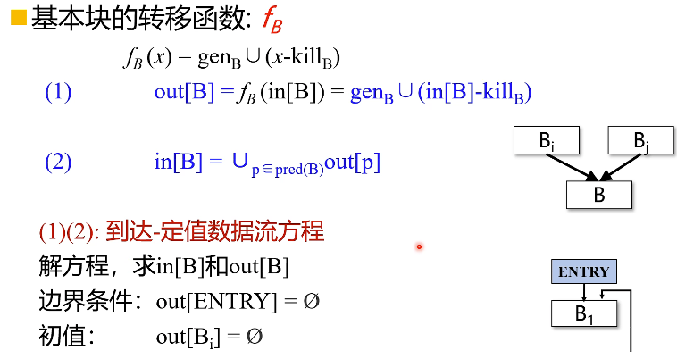
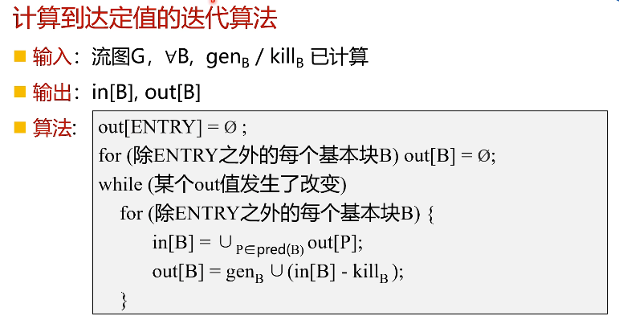
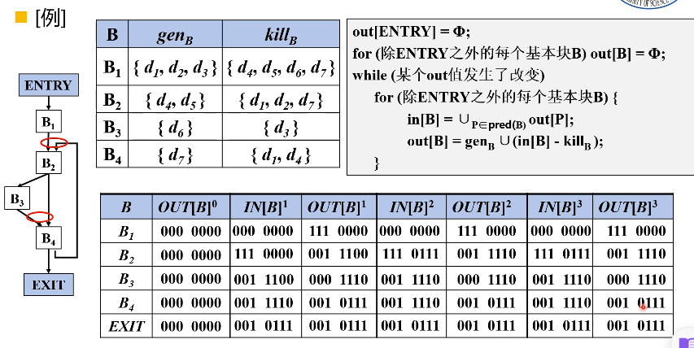
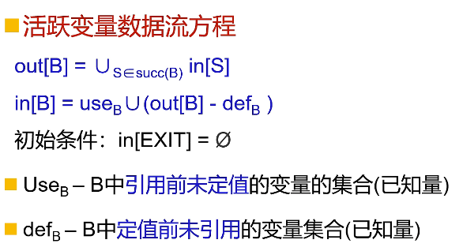
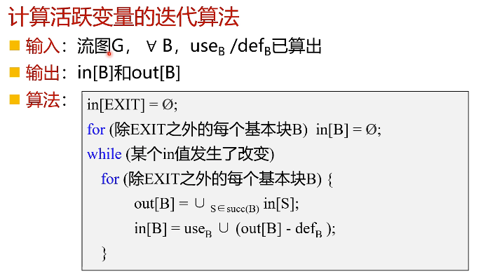
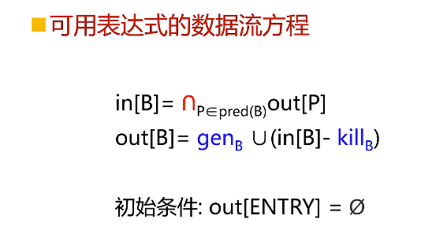
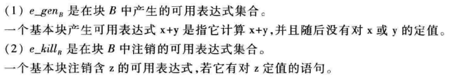
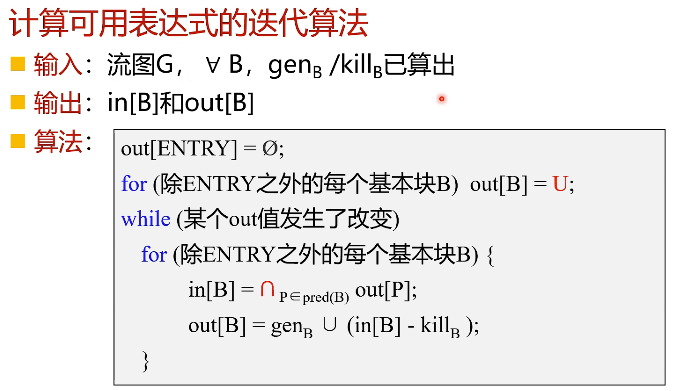

## 循环不变

## 流图支配关系

支配结点是指到目标结点必须经过的结点

- 初始化D（1）={1}，其他全集
- 从2开始，D（n）={n}并上n的前驱基本块的支配集的交集

例：

初始化D（1）={1}，其余为全集

D（2）={2}并D（1）交D（5）={1，2}（1和5是2 的前驱）

依次类推

## 流图找自然循环

自然循环从回边出发找，要求只能有一个入口（否则就是普通循环）

回边：支配关系中从最后结点到支配集里面的结点的边

例如在上图中的支配集写全如下：

D(1)={1} 

D(2)={1,2} 

D(3)={1,2,3} 

D(4)={1,2,3,4} 

D(5)={1,2,5} 

D(6)={1,2,5,6}

回边则有：4->3      ,         5->2

回边结点加入循环，再由回边从最后结点回溯，找前驱（舍去已在循环中的结点）

例如：

回边4->3，4和3加入循环，从4开始，4的前驱是3，已在循环中，不变，循环为{3，4}

回边5->2，5和2加入循环，从5开始，5的前驱是3，2，将3加入循环，3的前驱是4和2，将4加入循环，4的前驱是3，已在循环中，不变，循环为{2，3，4，5}

## 到达定值分析

定值：变量v的定值是（可能）将一个值赋给v的语句

到达定值：存在一条从定值d到程序点p的路径，且在此路径上d没有被杀死，则称定值d到达程序点p（即路径上没有其他定值d’对变量v重新定值）  

kill：在该基本块中的定值语句会杀死其他对同样变量赋值的定值语句，这些被杀死的定值语句的集合为kill

gen:  该基本块产生的定值语句

## 活跃变量分析

对于变量v和程序点p：流图中存在一条从p开始到通路引用v在p点的值，则v在点p是活跃的（即在被修改前用到了这个变量就是在p点活跃）

活跃变量分析是反向分析（找到引用往回追溯到定值处都是活跃的）

 use：B中右边使用的（在B中先定值了再使用不算）

def：B中左边定值的（在B中先引用了再定值不算）

 

## 可用表达式分析

可用表达式：从流图入口结点到达程序点p的每条路径都对表达式x op y进行计算，并且从最后一个这样的计算到点p之间没有再次对x或y定值，那么表达式x op y在点p是可用的（即点p时，表达式在之前计算过而且没有被修改，不需要重新计算）

 

